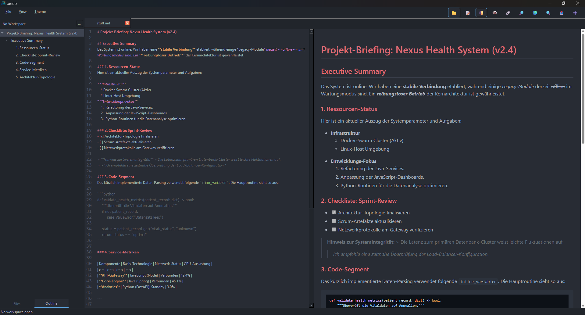
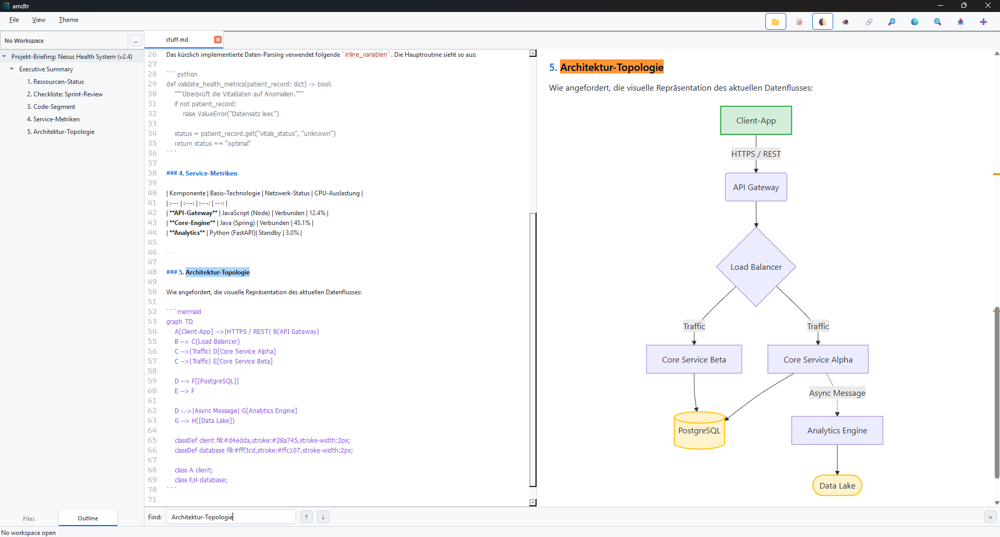

# amdtr (Another Markdown Editor) v1.0.0


**amdtr** is a professional, high-performance Markdown editor built with **Python 3** and **PyQt6**. It bridges the gap between raw text editing and rich visual previews, focusing on speed, extensibility, and portable document workflows.

## 📸 Screenshots

|  |  |
| :--- | :--- |
| **Dark Theme & Auto-Outline**: Comprehensive workspace with automated Table of Contents. | **Light Theme & Mermaid**: High-performance rendering of complex diagrams. |

## 🚀 Key Features

*   **⚡ High-Speed Live Preview:** Real-time rendering (150ms debounced) of Markdown, Mermaid diagrams, KaTeX math, and syntax-highlighted code blocks.
*   **💨 Streamlined Workspace:** Incremental batch indexing (FTS5) for lightning-fast loading of large folders. Only changed files are re-indexed based on their modification time.
*   **🛠️ Unified Header Bar:** A streamlined UI that merges menu and toolbar into a single, space-saving element for maximum focus.
*   **📂 Clean Projects:** No hidden `.amdtr` folders in your Markdown collections. All metadata (search index, session, and local configuration) is stored centrally in platform-standard application data folders.
*   **📂 Smart Management:** Integrated sidebar with file management (Rename/Delete), Wikilink support, and workspace-wide full-text search.
*   **📑 Document Outline:** Automatic Table of Contents (ToC) generation from Markdown headings for lightning-fast navigation.
*   **🎨 Custom Themes:** Fully skinnable UI and editor (JSON-based themes like One Dark or GitHub Light).
*   **📦 Portable Export:** One-click standalone HTML export with all assets (JS/CSS/Fonts) embedded for offline viewing.
*   **🔗 Scroll Sync:** Optional bi-directional scrolling between editor and preview.

## 🛠️ Getting Started (Windows)

### 1. Create and activate virtual environment
```sh
python -m venv .venv
.venv\Scripts\activate
```

### 2. Install dependencies
```sh
pip install -r requirements.txt
```

### 3. Setup vendor assets (JS/CSS)
Download required resources for the preview engine (one-time setup):
```sh
python setup_vendor.py
```

### 4. Run application
```sh
python main.py
```

## 📦 Build Standalone Executable
To create a standalone binary for your platform:
```sh
pip install pyinstaller
python build_app.py
```
The result will be available in the `dist/` directory.

## 📜 License
This project is licensed under the terms of the LICENSE file included in the repository.
